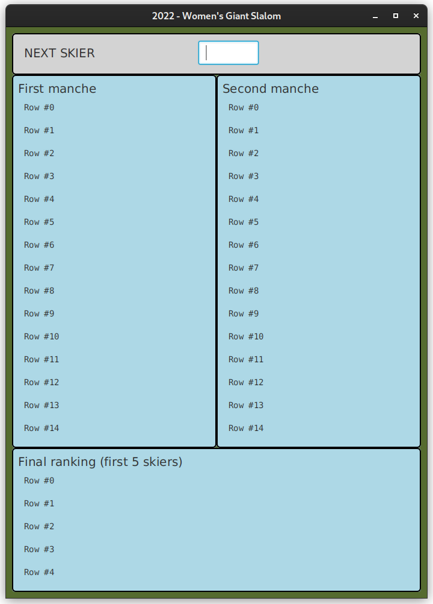
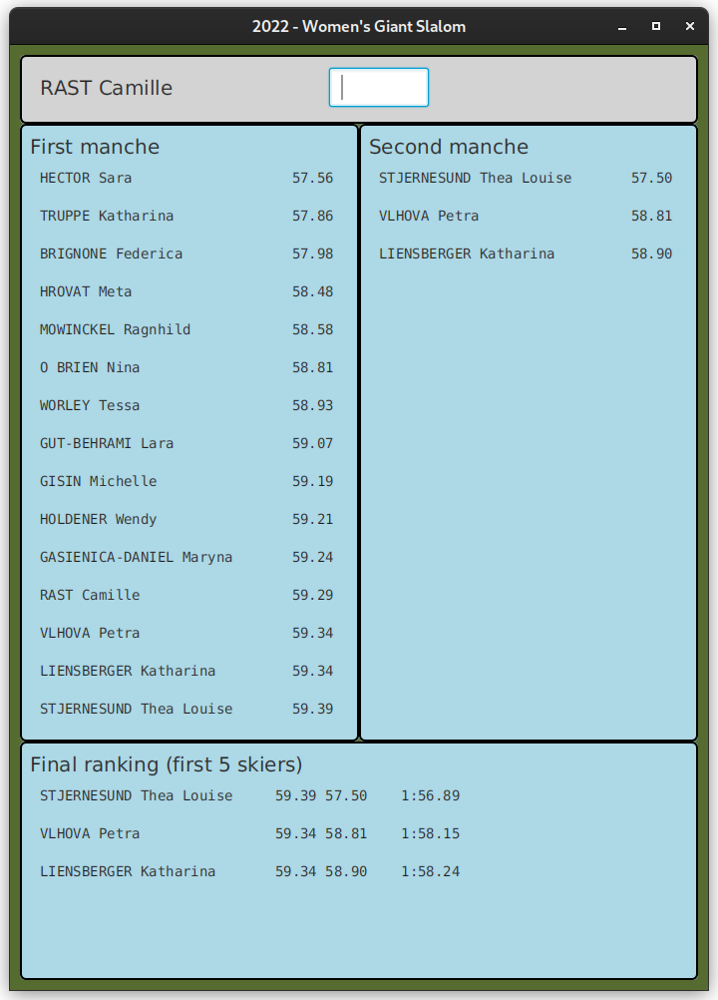

### SLALOM GIGANTE FEMMINILE: seconda _manche_

Obiettivo dell'esercizio è progettare e realizzare un insieme di classi atte a
produrre un programma Java che si occupi di gestire la classifica di
una gara di slalom gigante femminile. Vengono fornite già alcune classi e il programma va completato in modo da realizzare 
un'organizzazione del sistema di tipo *Model-View-Presenter*.

In particolare vengono fornite due *Viste* del sistema:

- `NextSkierView`: la vista che permette di chiedere e immettere il tempo ottenuto da una
  sciatrice nella seconda _manche_;
- `RankView`: un display generale che permette di visualizzare alcune righe di
 testo e può essere usato per visualizzare la graduatoria, cioè un elenco di
 nomi di sciatrici e i loro tempi, ordinati per tempi crescenti.

Il programma deve mostrare 3 classifiche:

1. la classifica della prima _manche_ già completata: i dati (nomi e tempi) delle 15 
   (`Main.SKIER_NUM`) sciatrici ammesse alla seconda 
   *manche* sono caricati una volta per tutte da un file (`src/main/resources/prima`)
   tramite la funzione `readFilePrimaManche` della classe `Model` (da completare);
2. la classifica della seconda _manche_: i cui tempi vengono immessi man mano che le
   sciatrici gareggiano in ordine inverso rispetto alla classifica della prima
   _manche_: l'ultima sciatrice della prima _manche_ è la prima a scendere nella seconda _manche_;
3. la classifica finale delle prime 5 (`Main.SKIER_NUM_TOTAL_RANK`) sciatrici, che tiene conto della somma dei tempi 
   delle due _manche_.

Lanciando il programma (tramite il task **run** di gradle) si ottiene inizialmente una
interfaccia come quella nella figura sottostante.

Dopo aver caricato correttamente il file della prima manche, si dovranno inserire nella vista in alto i tempi delle 
seconde _manche_ delle sciatrici il cui nome comparirà al posto della scritta **NEXT SKIER**.

Ad esempio dopo l'inserimento dei tempi delle prime 3 sciatrici della seconda _manche_ la situazione presentata 
potrebbe essere
la seguente (con le classifiche parziali della seconda _manche_ e totale  e con la richiesta del tempo della 
quart'ultima sciatrice della prima _manche_ _Camille RAST_).

Chiaramente le classifiche della seconda _manche_ e totale, rimangono in evoluzione fino alla discesa della ultima sciatrice.

Scesa l'ultima sciatrice, deve comparire la scritta **END OF SLALOM** e non accadere più nulla anche provando a inserire 
altri tempi.

Per semplicità potete assumere che:
- i tempi delle singole _manche_ siano sempre inferiori al minuto
- non ci siano sciatrici che non completano la gara
